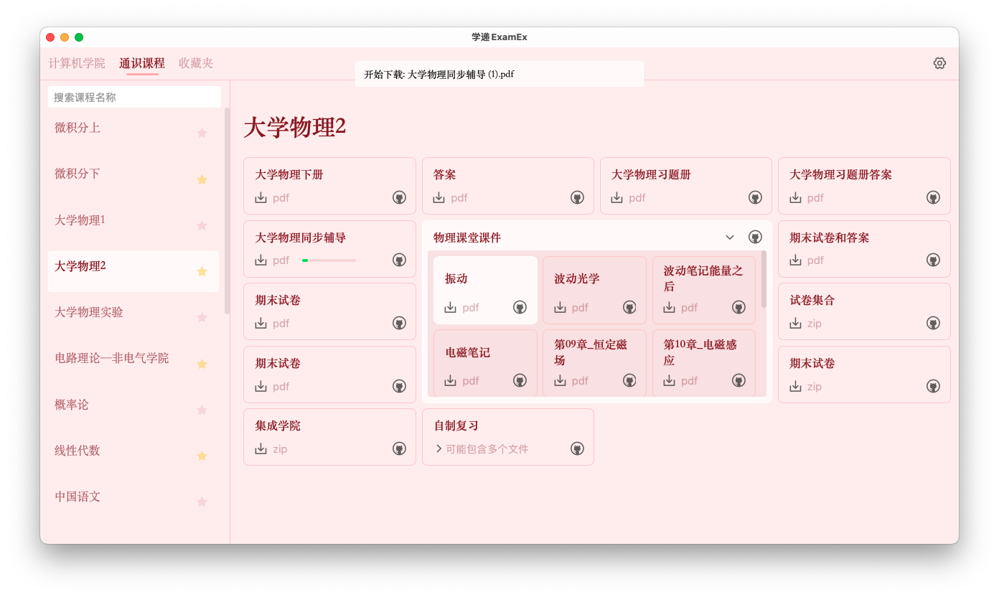

<h1 align="center">
  
  <br>
  学递 ExamEx
  <br>
  (Exam Express)
</h1>
<h3 align="center">
<br>课程资源共享仓库 - <a href="https://github.com/YuhangChen1/HUST_OPEN_SOURCE">华科开源计划</a>客户端
</h3>
<p align="center">更扁平地访问，更方便地下载，基于<a href="https://github.com/tauri-apps/tauri">Tauri</a>开发</p>

## 下载安装
支持 Windows 和 Mac OS([⚠️注意事项](#mac-os-使用注意))，请到发布页下载对应的安装包：[Release page](https://github.com/prcxhy/ExamEx/releases)<br>

## 简介
其实这个项目是桌饺子，它的中文名字就是那碟醋（HUSTer们懂得都懂）<br>
不知不觉我已经是个7年的华科老登了，本科那4年，确实在整活方面从来不缺行动力，回想确实精彩<br>
而今几乎在科研的苦海中沉底，渐渐变得油滑麻木，多亏[**Francis学弟**](https://github.com/YuhangChen1)的计划点燃了我一丝往日的热血<br>
为了后辈们的GPA，那咱就接着开整吧～

### 应用预览


### ToDo
- [ ] 课程收藏夹
- [ ] 可选下载路径
- [ ] 多文件目录资源的扁平化(深度1)展示
- [ ] md非链接内容的解析与美化渲染
- [ ] 资源卡片分类展示

## 外校仓库适配
如果想要通过此客户端访问你们学校的课程共享仓库(github)，需要按以下步骤进行适配
### 步骤1. 创建索引目录
你们学校的课程共享仓库需包含一个索引目录，**目前支持的**结构和内容如下
```
仓库根目录
    ├── 课程资源文件目录
    └── 索引目录    <-- 将使用这一级的url
          ├── 通识课程    <-- 必含
          ├── 学院 1
          ├── 学院 2
          │    ···
          └── 学院 N
                ├── index.md    <-- 必含，内容为下列课程md文件的链接
                ├── 课程1.md         即：[课程N的名字](课程N.md的url)
                ├── 课程2.md
                │    ···
                └── 课程N.md    <-- 内容为该课程各种资源的链接
                                    即：[课件/试卷/网页等](对应的url)
                                    对于文件资源，建议一个链接一个文件
                                    若要使用仓库目录url来包含多个文件
                                    建议不要嵌套更深的目录来包含文件
                                    保持目录深度1，必要时请使用压缩包
```
### 步骤2. 添加索引目录的 url 到 universities.json
universities.json 在学递ExamEx的**安装目录**下，向其添加上面的索引目录的url：
```json
[
  {
    "name": "别的学校",
    "repository": "他们仓库的索引目录url"
  },
  {
    "name": "你的学校",
    "repository": "你们仓库的索引目录url"
  },
]
```
当然，也欢迎将你们仓库的信息PR到该项目的 [universities.json](./src-tauri/universities.json) 中进行收录

## Mac OS 使用注意
由于开发者没钱注册Apple开发者账号，无法给此应用合法签名，在Mac OS上安装后直接启动会提示文件损坏，采取以下步骤方可正常使用

1. 正常安装后，拖动安装文件夹(默认是**Applications**)至**终端**打开
2. 输入并回车执行以下命令:
   
   ```bash
   xattr -cr 学递ExamEx.app
   ```
3. 即可正常启动 学递ExamEx

## License
GPL-3.0 License. See [License here](./LICENSE) for details.
